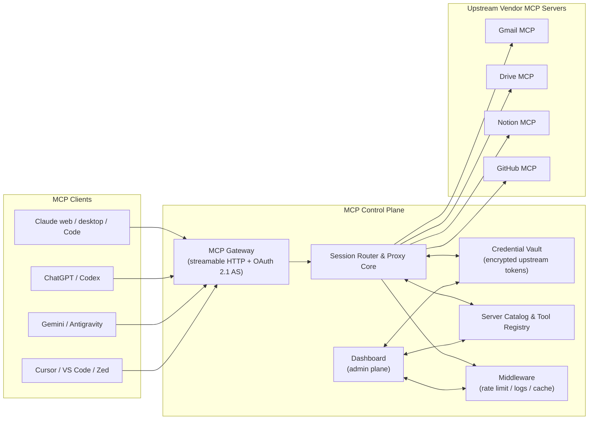
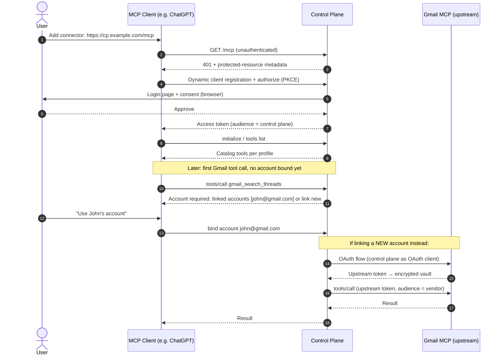
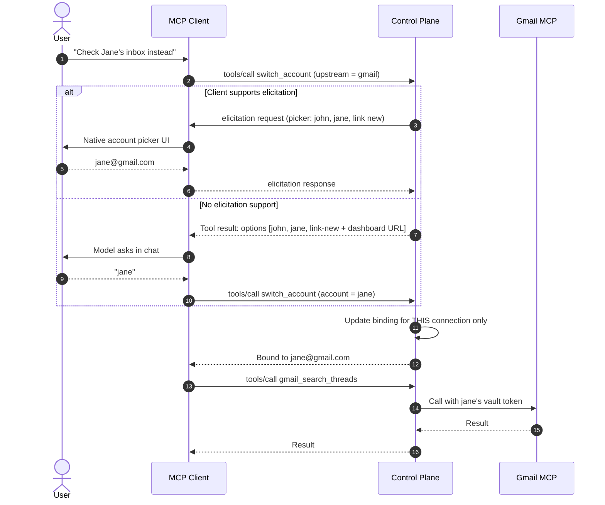
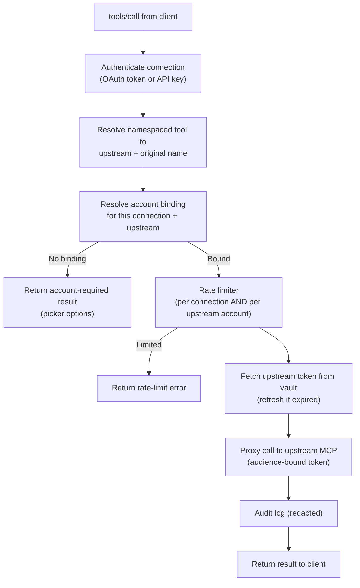
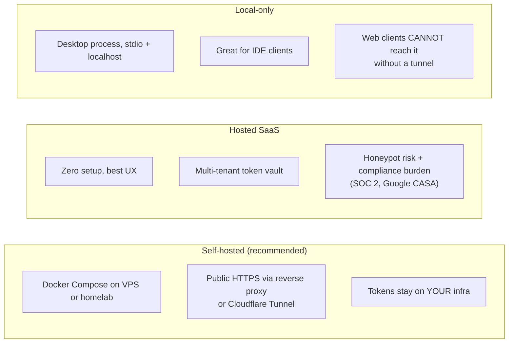

# Control Plane for MCP

**One MCP endpoint for every client. One place for every credential.**

A self-hostable MCP proxy that sits between your MCP clients (Claude, ChatGPT, Gemini, Cursor, VS Code, …) and vendor MCP servers (Gmail, Drive, Notion, GitHub, …). Clients configure a single connection to the control plane; the control plane owns upstream auth, account selection, the server catalog, and cross-cutting middleware (rate limiting, logging, caching), with a dashboard as the administrative layer.

> **Status:** design doc / spec. Nothing is built yet. This document is deliberately honest about constraints and risks — see [Design constraints](#design-constraints--client-compatibility), [Security considerations](#security-considerations), and [Prior art](#prior-art--differentiation).

---

## The problem

MCP adoption created an **N × M × K** mess:

- **N clients** — Claude web/desktop/Code, ChatGPT web/app/Codex, Gemini app/CLI/Antigravity, Cursor, VS Code, Windsurf, Zed… each with its own config surface. IDEs use editable JSON; web apps only expose a connectors UI with no config file at all.
- **M servers** — Gmail, Drive, Notion, GitHub… each added, updated, and removed **per client, by hand**.
- **K accounts** — every client × server pair runs its **own OAuth flow** and holds its **own token**. Connecting Gmail in ChatGPT does nothing for Gemini. Switching from John's Gmail to Jane's means re-authing in every client.

Adding a server means N configuration edits. Rotating a credential means N re-auths. Removing a server means hoping you remembered all N places. There is no single view of what is connected to what, and no audit trail of what your agents actually did.

## The solution

Invert the topology. Clients stop connecting to M servers each; they connect to **one control plane**, which connects to the M servers **once**:

Each client holds exactly one config entry (a URL, plus OAuth or an API key depending on what the client supports). Everything else — which servers exist, which accounts are linked, which tools are exposed — lives server-side and is managed once, in the dashboard.

---

## Core concepts

| Concept | Definition |
|---|---|
| **Upstream server** | A vendor MCP server the control plane proxies (Gmail, Drive, …). Registered once, in the dashboard. |
| **Linked account** | An authorized identity at an upstream server (e.g. `john@gmail.com` at Gmail MCP). One upstream can have many linked accounts. The control plane holds the upstream token for each. |
| **Client connection** | A client's authenticated relationship with the control plane — an OAuth grant (web clients) or an API key (header-capable clients). Each connection has its own identity, rate limits, and audit trail. |
| **Account binding** | Which linked account a given client connection uses for a given upstream. Bindings are **per connection, per upstream** — ChatGPT can be bound to Jane's Gmail while Gemini stays on John's, simultaneously. |
| **Profile** | A named subset of the catalog (servers + tools) exposed to a connection. Controls context bloat and blast radius per client. |

---

## Auth model

The control plane plays **two OAuth roles at once**, and keeps them strictly separated:

1. **Toward clients — it is an OAuth 2.1 authorization server + resource server.** This is not optional. Claude web and ChatGPT connectors support *only* OAuth (or no auth) — they cannot send API-key headers, and tokens in query strings are prohibited by the MCP spec. So the control plane must implement: protected-resource metadata (RFC 9728), authorization-server metadata, **dynamic client registration** (RFC 7591) so web clients can self-register, PKCE, and token issuance. Header-capable clients (Claude Code, Cursor, VS Code, Gemini CLI, Antigravity) get the simpler path: per-client API keys.
2. **Toward upstreams — it is an ordinary MCP OAuth client.** It runs each vendor's OAuth flow once per linked account and stores the resulting tokens in the encrypted vault, refreshing them as needed.

**Tokens never cross the boundary.** A client token is validated, mapped to a connection, and *discarded*; upstream calls always use the vault's own upstream token for the bound account. Passing a client's token through to an upstream (or vice versa) is the "token passthrough" anti-pattern the MCP security best-practices document explicitly forbids — it collapses two trust boundaries into one and breaks audit, rate limiting, and audience validation (RFC 8707).

### First connection + account linking

The key property: the **second** client to connect (Gemini, say) skips the vendor OAuth entirely. It authenticates to the control plane, sees `john@gmail.com` already linked, and binds to it in one step.

---

## Account picking & switching

Every connection carries an account binding per upstream. Switching is a first-class operation, exposed three ways because client capabilities differ wildly:

1. **Elicitation** (richest UX) — where the client supports MCP elicitation (VS Code, Cursor form-mode), the control plane raises a structured picker mid-tool-call: choose a linked account or "link new".
2. **Tool-result prompt** (universal fallback) — for clients without elicitation (Claude web, ChatGPT, Gemini CLI as of early 2026), the tool call returns a structured "account required / ambiguous" result listing options. The model relays the choice to the user in chat, then calls the exposed `switch_account` tool. Linking a *new* account returns a dashboard URL the user opens in a browser.
3. **Dashboard** — bindings are always visible and editable per connection in the dashboard.

**Scoping rule:** a switch affects only the connection that requested it. ChatGPT moving to Jane never silently changes what Gemini or Cursor see. Global rebinding is a dashboard action.

---

## Server catalog & tool loading

### Catalog and namespacing

Upstream servers are registered once (dashboard), and their tools are ingested into a registry. Tools are exposed to clients under a namespaced name — `gmail_search_threads`, `drive_search_files` — to prevent collisions between upstreams. Namespacing must respect client naming constraints (character-set and length limits, commonly ~64 chars), so the registry stores a mapping of `exposed name → (upstream, original name)` and truncates/deduplicates deterministically rather than assuming concatenation always fits.

### Lazy loading (reducing context bloat)

Aggregating many servers behind one endpoint makes tool-list bloat *worse* by default — 10 upstreams × 20 tools = 200 tool schemas in every conversation's context. Three mechanisms counter this:

- **Profiles** (always works) — each connection is assigned a profile that whitelists servers/tools. An IDE connection might get the full dev toolset; a phone chat client gets 8 tools. This is the primary and most reliable lever, because it needs nothing from the client.
- **Dynamic tool lists** (where supported) — for clients honoring `tools/list_changed` (Claude Code, Cursor, VS Code), the control plane starts with a slim list and expands it when the user activates a server mid-session.
- **Meta-tool mode** (fallback) — for clients that fetch the tool list once and never again (Claude web, ChatGPT, Gemini CLI), the control plane can expose three generic tools instead: `list_servers`, `search_tools`, `invoke_tool`. This keeps context tiny at the cost of weaker schemas and one extra model round-trip per call. It is a mode per profile, not the default.

### Tool-call lifecycle

### Sessions

The proxy maintains N client sessions (streamable HTTP) fanned out to M upstream sessions per linked account. It owns: upstream reconnection, token refresh mid-session, and routing of upstream notifications (progress, logging) back to the right client session. Upstream-initiated `sampling` requests are **not** forwarded in v1 (almost no chat client supports them; the proxy responds with a capability-not-supported error).

---

## Middleware

| Layer | Policy |
|---|---|
| **Rate limiting** | Two independent budgets: per client connection (protects the control plane and your upstream quotas from a runaway agent) and per upstream account (respects vendor limits; prevents one client from starving others sharing the same linked account). |
| **Logging / audit** | Structured log per tool call: connection, upstream, account, tool, latency, outcome. Payload logging is **off by default** — tool arguments and results routinely contain email bodies and documents. Opt-in per upstream, with redaction rules and a retention window. Logs are viewable in the dashboard. |
| **Caching** | Cache **metadata only** by default: upstream tool lists, server capabilities, catalog pages. Tool *results* are never cached by default — results are permission-scoped, account-scoped, and instantly stale (a cached inbox search served to the wrong binding is a data leak). Per-tool opt-in result caching with short TTLs may come later for provably idempotent, account-keyed reads. |

---

## Dashboard

The dashboard is the **administrative plane**; the MCP endpoint is the **data plane**. The split is a deliberate security boundary:

- **Dashboard-only (destructive / structural):** register or remove upstream servers, link or unlink accounts, create/revoke client keys and OAuth grants, edit profiles, change global bindings, view audit logs, configure rate limits and retention.
- **MCP-exposed (session-scoped, reversible):** call tools, list catalog, bind/switch among *already-linked* accounts for *your own* connection.

A prompt-injected model can therefore never unlink an account, delete a server, or mint credentials — the worst it can do through the MCP surface is switch its own session between accounts the user already linked, and every such action is audit-logged.

---

## Deployment models

| | Self-hosted | Hosted SaaS | Local-only |
|---|---|---|---|
| Works with web clients (claude.ai, ChatGPT) | ✅ (needs public HTTPS) | ✅ | ❌ without a tunnel — and a tunnel makes it self-hosted |
| Who holds the Gmail/Drive tokens | You | The vendor (you) — a multi-tenant honeypot | You |
| Compliance burden | Yours, minimal | SOC 2, Google restricted-scope verification (CASA), incident response | Minimal |
| Setup friction | Medium (Docker + domain/tunnel) | None | Low |
| Trust required from user | Own infra | High — a startup holding refresh tokens for your email | Own machine |

**Recommendation: self-hosted first.** The killer feature (web-client coverage) requires a public HTTPS endpoint, which rules out local-only as the primary mode. SaaS is the worst *starting* point: the product's whole value is concentrating credentials, and a multi-tenant credential concentrator must clear a security bar (SOC 2, CASA for Google restricted scopes, breach liability) that is fatal at MVP stage. Self-hosted keeps the trust story clean — *your* tokens on *your* box — while a `docker compose up` + Cloudflare Tunnel path keeps setup under 15 minutes. A hosted offering can follow once the design is proven, as a paid convenience tier.

A thin **stdio shim** (à la `mcp-remote`) ships alongside for clients or setups that want a local stdio entry point bridging to the HTTPS endpoint.

---

## Design constraints & client compatibility

These are the facts that shaped the design. The original "one URL + API key everywhere" framing does not survive contact with the client landscape — the web clients force OAuth.

| Client | Remote MCP | API key / custom headers | OAuth to control plane | Elicitation | `tools/list_changed` |
|---|---|---|---|---|---|
| Claude web (claude.ai connectors) | ✅ HTTPS only | ❌ | ✅ (required; DCR) | ❌ | ❌ |
| Claude Desktop / Claude Code | ✅ | ✅ | ✅ | Partial (URL mode) | ✅ |
| ChatGPT (developer mode / apps) | ✅ HTTPS only | ❌ (OAuth or no-auth) | ✅ (required; DCR) | ❌ | ❌ |
| Gemini CLI | ✅ | ✅ | ✅ | ❌ | ❌ |
| Antigravity | ✅ | ✅ (bearer via headers) | — | ❌ | ❌ |
| Cursor | ✅ | ✅ | ✅ | ✅ (form) | ✅ |
| VS Code | ✅ | ✅ | ✅ | ✅ | ✅ |

Consequences baked into the spec:

1. **OAuth 2.1 server is table stakes**, not an enhancement. DCR, PKCE, resource metadata, consent UI — all required before Claude web or ChatGPT can connect at all. This is the single largest chunk of MVP engineering.
2. **Elicitation cannot be the primary account-picker** — the two most important clients don't support it. The tool-result + `switch_account` pattern is the baseline; elicitation is progressive enhancement.
3. **Dynamic tool loading cannot be assumed** — web clients fetch tool lists once. Profiles and meta-tool mode carry the context-bloat feature; `list_changed` is enhancement.
4. **ChatGPT constraints**: no MCP resources support; deep-research mode expects `search`/`fetch` tools; connector policies have shifted repeatedly (connectors were renamed "apps" in Dec 2025). Treat ChatGPT compatibility as a moving target with its own test suite.
5. **Per-client OAuth callback quirks**: each web client registers with its own callback URLs and interprets metadata slightly differently (e.g. known claude.ai issues with external authorization servers). Budget for per-client conformance testing.

---

## Security considerations

Concentrating every credential and every tool call in one process is the product *and* the threat model. Named risks and stances:

- **Vault blast radius.** The vault holds refresh tokens for your email and files. Mitigations: encryption at rest with a key outside the DB (KMS/file), short-lived upstream access tokens where vendors allow, per-connection revocation, and the self-hosted-first posture so compromise is per-user, not fleet-wide.
- **Token passthrough is forbidden.** Client tokens are audience-bound to the control plane (RFC 8707) and never forwarded; upstream tokens never reach clients. The control plane is a full trust boundary, not a relay.
- **Confused deputy.** The control plane acts on behalf of many clients against many upstreams. Every call resolves authorization from *its own* records (connection → binding → vault token) rather than trusting anything the client asserts about identity or account.
- **Cross-server prompt injection / exfiltration.** Aggregation widens the blast radius: a malicious document read via one upstream can steer the model to call another (read email → post to attacker's webhook). Mitigations: profiles keep unrelated tools out of the same session; per-upstream allow/deny rules; tool descriptions from upstreams are sanitized and pinned (a changed upstream tool description is flagged in the dashboard, not silently adopted — guards against rug-pulls); optional confirmation policy for write-class tools.
- **Session hijacking.** Streamable HTTP session IDs are random, bound to the authenticated connection, and never used as an authentication factor on their own (per MCP security best practices).
- **Logs are sensitive.** Payload logging off by default, redaction on, retention bounded. An audit trail of your agent's Gmail calls is itself a copy of your email.
- **The dashboard is now critical infrastructure.** It gates destructive actions, so it needs real authn (passkeys/TOTP), CSRF protection, and no CORS exposure of admin APIs.

---

## Prior art & differentiation

The MCP gateway space is crowded (a Q1 2026 ecosystem survey counts 17+ aggregator/gateway/proxy tools). Honest positioning:

| Project | What it is | Where this design differs |
|---|---|---|
| **MetaMCP** | OSS aggregator/orchestrator: servers → namespaces → endpoints, middleware, Docker | Closest analog. Oriented to tool curation; this design centers *multi-account identity* (linked accounts, per-connection bindings, in-session switching) as the primary object. |
| **Cloudflare MCP Server Portals** | Enterprise portal: many servers behind one URL, SSO-gated | Same topology, enterprise IT buyer, Cloudflare-hosted. This targets the individual/prosumer running their own plane across *personal* accounts. |
| **Docker MCP Gateway / Toolkit** | Local gateway; each server containerized; signed images; secrets mgmt | Local-first, so weak on web clients; account model is one-account-per-server. |
| **Composio / Pipedream MCP** | Hosted, managed integration catalogs (hundreds of SaaS tools) with hosted auth | SaaS holding your tokens; their catalog, not arbitrary MCP servers. This is bring-your-own-server and self-hosted. |
| **Obot, Microsoft MCP Gateway, Kong AI proxy, IBM ContextForge, agentgateway…** | Enterprise governance gateways (policy, DLP, RBAC, K8s) | Org fleet management; nobody's product is "John and Jane's Gmail in every chat app". |
| **mcp-remote / mcp-proxy / Supergateway** | Thin transport bridges (stdio↔HTTP) | Plumbing, not a control plane; no vault, catalog, or account model. Reused as the stdio shim. |

**The differentiated core is the account layer**: linked accounts as first-class objects, per-connection bindings, and in-session account switching that works even on the lowest-capability clients. Nobody in the table above does cross-client *personal* multi-account identity well. The corollary: catalog, rate limiting, logging, and caching are commodity table stakes — they justify no product on their own.

---

## MVP scope & roadmap

**Phase 1 — the spine** (proves the thesis)
- Streamable HTTP gateway + OAuth 2.1 AS toward clients (DCR, PKCE, RFC 9728 metadata, consent UI) and API-key auth for header-capable clients
- OAuth client toward upstreams + encrypted vault; **2 upstreams** (e.g. Gmail, Drive)
- Linked accounts, per-connection bindings, `switch_account` via tool-result flow
- Namespaced static catalog, per-connection profiles
- Minimal dashboard: servers, accounts, keys, bindings, log view
- Audit logging (metadata only); Docker Compose deploy + tunnel guide
- Conformance tests against Claude web, ChatGPT dev mode, Claude Code, Cursor

**Phase 2 — leverage**
- Elicitation-based picker; `tools/list_changed` dynamic loading; meta-tool mode
- Rate limiting (both budgets); tool-description pinning + change alerts
- stdio shim; more upstreams; upstream health checks

**Phase 3 — hardening / optional SaaS**
- Write-tool confirmation policies; redaction rules; retention controls
- Passkey dashboard auth; secrets backend (KMS) options
- Evaluate hosted tier only if self-hosted demand proves the account-layer thesis

**Explicit non-goals (v1):** sampling passthrough, result caching, multi-user/team tenancy, being an enterprise policy engine.
