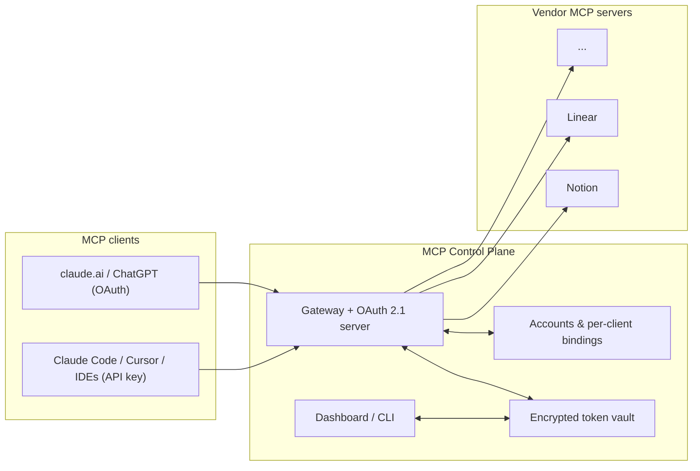

# MCP Control Plane

**One MCP endpoint for every client. One place for every credential.**

A self-hostable proxy that sits between your MCP clients (claude.ai, ChatGPT, Claude Code, Cursor, VS Code, Antigravity, …) and vendor MCP servers (Notion, Linear, GitHub, …). Instead of configuring every vendor in every client and re-doing OAuth for each pair, each client connects once to the control plane — which holds the vendor credentials, proxies the tools, and lets each client pick which account to act as.

## Features

- **Single endpoint** — clients configure one URL. Vendor tools are exposed namespaced (`notion_search`, `linear_list_issues`) with their original schemas, and a `tools/list_changed` notification is broadcast when the catalog changes.
- **Works with web clients** — the control plane is a full OAuth 2.1 authorization server (dynamic client registration, PKCE, consent screen), which is what claude.ai and ChatGPT connectors require. IDE clients can use plain API keys instead.
- **Link a vendor account once, use it from every client** — vendor OAuth (discovery → registration → PKCE) runs server-side; tokens are stored AES-256-GCM encrypted. Linking works from the dashboard in any browser, including incognito for second accounts.
- **Per-client account switching** — multiple accounts per vendor, with an independent binding per client connection. ChatGPT can act as Jane's Notion while Cursor stays on John's, and models switch accounts mid-chat via the built-in `switch_account` tool.
- **Profiles** — per-connection tool allowlists (exact, `*`, or prefix patterns), so a phone client can see 8 tools while your IDE sees all of them.
- **Audit log** — one metadata-only row per tool call (connection, tool, upstream, account, outcome, latency). Arguments and results are never stored.
- **Dashboard + CLI** — a password-protected dashboard for upstreams, accounts, keys, profiles, and the audit trail; destructive actions live only there, never on the MCP surface. Every operation is also available as a CLI ([CLI.md](CLI.md)).
- **Resilient proxying** — per-(vendor, account) upstream sessions, automatic token refresh, lazy reconnects, and readable errors when an upstream is down.

## How it works



Client credentials never reach vendors and vendor tokens never reach clients — the control plane is its own trust boundary on both sides.

## Quickstart

Requires Node 22+.

```bash
npm install
npm run key -- master              # prints CP_MASTER_KEY — put it in .env
cp .env.example .env               # fill in CP_MASTER_KEY
npm run owner -- set-password      # dashboard + consent-screen password
npm run dev                        # http://127.0.0.1:8720
```

Add a vendor and link an account:

```bash
npm run upstream -- add notion https://mcp.notion.com/mcp --oauth
npm run account -- link notion --label you@example.com   # opens the vendor consent in your browser
```

Create a key and connect an IDE client:

```bash
npm run key -- create my-laptop
claude mcp add --transport http control-plane http://127.0.0.1:8720/mcp \
  --header "Authorization: Bearer cpk_..."
```

Ask the model to call `control_plane_status` — it reports connected vendors, tool counts, and this connection's account bindings.

## Connecting web clients (claude.ai, ChatGPT)

Web connectors need a public HTTPS URL. Expose the server (tunnel or real deploy — see [DEPLOY.md](DEPLOY.md)), set `CP_PUBLIC_URL` to that origin, then add `https://<host>/mcp` as a custom connector. The client discovers the auth server, registers itself, and sends you to the consent screen — approve with the owner password. Each approved client becomes its own connection with its own bindings and audit trail; revoke it anytime.

## Accounts and switching

Link as many accounts per vendor as you need (use an incognito window for the second — the vendor consent screen follows your browser session, not the label). From any client's chat:

- *"Which accounts do I have on Notion?"* → the model calls `list_accounts`
- *"Use the work account"* → the model calls `switch_account` — this connection only; other clients keep their bindings
- With exactly one linked account, it is bound automatically; with several, the first call returns a structured account picker for the model to relay.

## Configuration

| Variable | Purpose | Default |
|---|---|---|
| `CP_PUBLIC_URL` | Public origin, baked into OAuth metadata and callbacks | `http://localhost:8720` |
| `CP_MASTER_KEY` | 32-byte vault key for upstream tokens (`npm run key -- master`) | — (required for OAuth/bearer vendors) |
| `CP_OWNER_PASSWORD` | Seeds the owner password on first boot (or use the CLI) | — |
| `PORT` / `CP_HOST` | HTTP listener | `8720` / `127.0.0.1` |
| `CP_DB_PATH` | SQLite database file | `./data/control-plane.db` |
| `CP_REGISTRY_POLL_MS` | Catalog-change poll for `tools/list_changed` | `5000` |

## Deployment

`docker compose up -d` locally, or one-click-ish on Railway (Dockerfile + `railway.json` + `/healthz` are set up) — full steps, env vars, and gotchas in [DEPLOY.md](DEPLOY.md).

## Documentation

- [WALKTHROUGH.md](WALKTHROUGH.md) — hands-on tour of every feature, plus known issues
- [CLI.md](CLI.md) — complete CLI reference (keys, upstreams, accounts, profiles, audit)
- [DEPLOY.md](DEPLOY.md) — Railway and Docker deployment

## Development

```bash
npm test              # integration-heavy suite (mock vendors, mock OAuth servers)
npx tsc --noEmit      # typecheck
```

Built with the official [MCP TypeScript SDK](https://github.com/modelcontextprotocol/typescript-sdk), Express 5, and SQLite. CI runs the suite and boots the Docker image on every push.

## License

MIT
